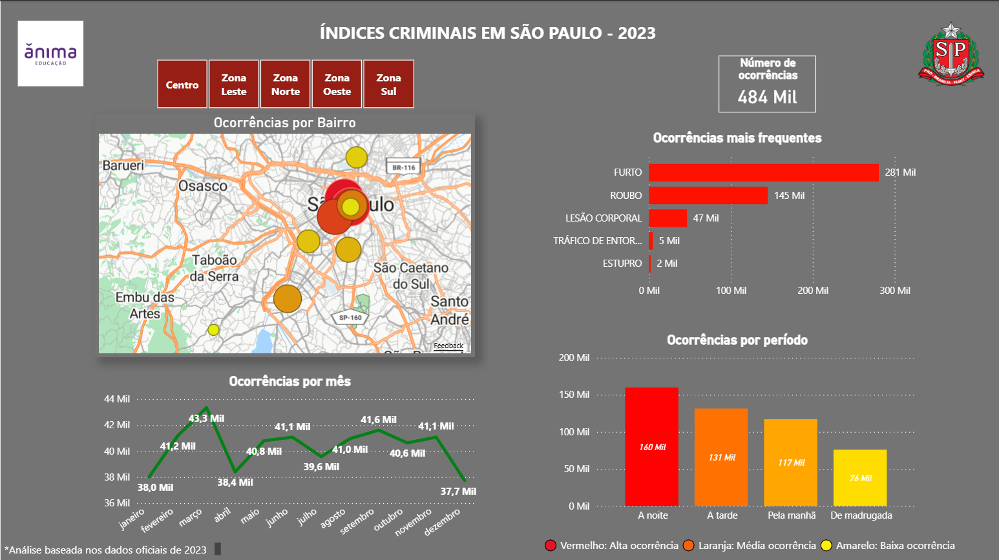

# Dashboard Criminalidade SP 2023

Dashboard desenvolvido em Power BI para análise dos índices de criminalidade da cidade de São Paulo utilizando dados oficiais de 2023.

## Objetivo

Analisar os registros de ocorrências criminais da cidade de São Paulo, identificando padrões geográficos, temporais e os tipos de crimes mais frequentes.

## Indicadores

- Número total de ocorrências
- Distribuição de ocorrências por bairro
- Crimes mais frequentes
- Ocorrências por período do dia
- Evolução mensal das ocorrências
- Análise por região da cidade

## Visualizações

- Mapa interativo de ocorrências por bairro
- Gráfico de crimes mais frequentes
- Gráfico de ocorrências por período
- Evolução mensal das ocorrências
- KPI com total de registros
- Filtros por região da cidade

## Ferramentas Utilizadas

- Power BI
- Power Query
- Excel

## Tratamento de Dados

- Limpeza e estruturação das informações
- Organização das bases para análise
- Transformação de dados para visualização
- Criação de medidas e indicadores para apoio à análise

## Dashboard

